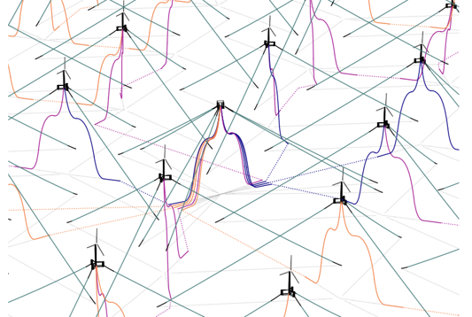
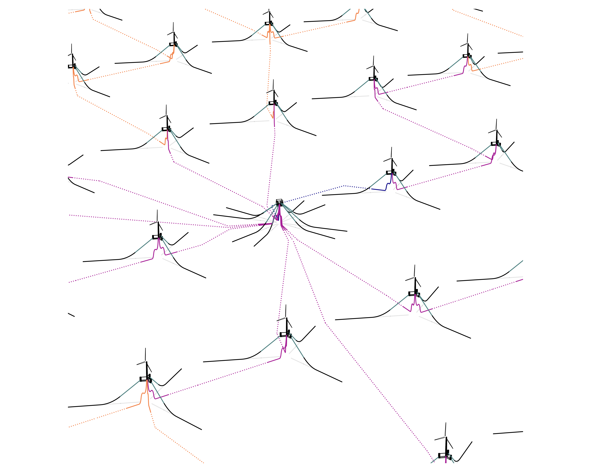
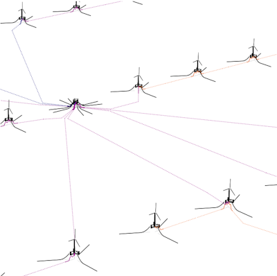

# Reference Array Designs

This folder contains input files for NREL's reference floating wind array 
designs, developed as part of the Floating Wind Array Design project. 
The designs include platform layouts, cable routing, substation placement, 
mooring and cable designs, and anchor types developed for three U.S. 
locations. The locations vary in water depths, ranging from deep water 
(800 m) to intermediate (200 m) to to shallow (80 m), and metocean conditions,
as described in [1]. The metocean conditions, including fatigue bins and extreme
load conditions developed from the dataset, are provided in [2], 
with methodology described in [1]. Bathymetry and sediment information for 
each region is also provided in [2]. These 
datasets can be found [here](https://data.nrel.gov/submissions/241).

The floating wind turbines in the designs are the IEA Wind 15 MW turbine [3] 
and VolturnUS-S semisubmersible platform [4]. Mooring system and dynamic
power cable designs are incorporated from a previous recent publication [5].
A substation design is included, adapted from the work of F. Jorge Alcantara [6].

The array design process and design details will be described in an upcoming work.

The design files are provided in the format of the Floating Wind Array 
Ontology, which is explained [here](https://github.com/IEAWindTask49/Ontology).

## Deep-water design

This design is based on Humboldt Bay, California site conditions at 800 m water 
depth and features 67 turbines in a uniform grid with taut mooring systems and
lazy wave dynamic cables. Cables are routed to avoid the large mooring footprints 
at this water depth. There is a substation at the center of the array.

## Intermediate-depth design

This design is based on Gulf of Maine site conditions at 200 m water depth and 
features 132 turbines for a total capacity of 1.98 GW in a square grid. The 
platforms have semi-taut mooring systems and lazy-wave dynamic cables.
Two substations were placed in the array, each receiving nine cable strings.

## Shallow-water design

This design is based on Gulf of America site conditions at 80 m water depth and
features 67 turbines in a rectangular grid with catenary mooring systems and 
lazy wave dynamic cables. There is a substation at the center of the array.

## References

[1] [M. Biglu, M. Hall, E. Lozon, and S. Housner, �Reference Site Conditions for Floating Wind Arrays in the United States,� NREL/TP-5000-89897, 2024.](https://docs.nrel.gov/docs/fy24osti/89897.pdf)

[2] [M. Biglu, M. Hall, E. Lozon, and S. Housner, "Reference Site Condition Datasets for Floating Wind Arrays in the United States." NREL Data Catalog. Golden, CO: National Renewable Energy Laboratory. 2024. Last updated: January 16, 2025. DOI: 10.7799/2425969](https://data.nrel.gov/submissions/241)

[3] [E. Gaertner et al., �Definition of the IEA 15-Megawatt Offshore Reference Wind Turbine,� NREL/TP-5000-75698, 2020.](https://docs.nrel.gov/docs/fy20osti/75698.pdf)

[4] [C. Allen et al., �Definition of the UMaine VolturnUS-S Reference Platform Developed for the IEA Wind 15-Megawatt Offshore Reference Wind Turbine,� NREL/TP-5000-76773, 2020.](https://docs.nrel.gov/docs/fy20osti/76773.pdf)

[5] [E. Lozon, M. Lekkala, L. Sirkis, and M. Hall, "Reference mooring and dynamic cable designs for representative U.S. floating wind farms", Ocean Engineering, 2025](https://doi.org/10.1016/j.oceaneng.2025.120473)

[6] F. Jorge Alcantara, Design of a Floating Foundation for an HVAC Off-
shore Substation, Ph.D. thesis, Universite de Liege, Belgium.

